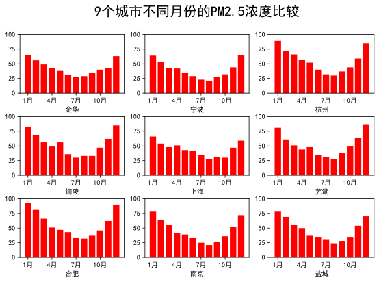
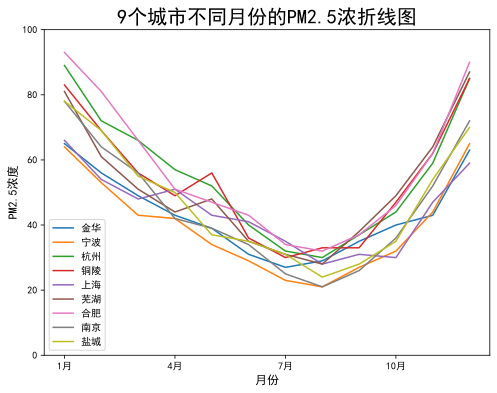
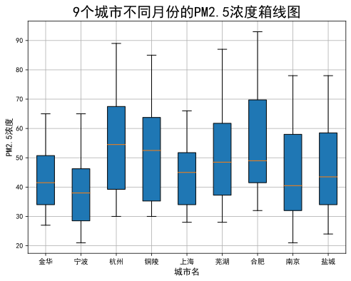
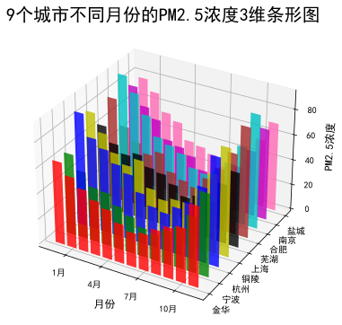
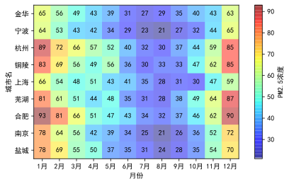

# 实习三 数组操作和图表绘制

本次作业方法不限，绘图方法大致相似，因此不在代码层面过多涉及，仅展示部分作业内容和一些想法

## 条形图

    

## 折线图

    

## 箱线图

    

## 三维条形图

    

## 个人想法

这次作业要求展示每个城市 PM2.5 浓度的月变化以及各个城市 PM2.5 浓度的差异，我自己尝试了通过注记热力图的形式进行展现，代码参考了[annotated heatmaps](https://matplotlib.org/stable/gallery/images_contours_and_fields/image_annotated_heatmap.html)的内容，针对本问题进行改写

### 注记热力图

    

另外，在上交的作业中，同学们都是将各城市的 PM2.5 浓度数据直接写在代码内，我个人的建议是将代码和数据分离，可以先把数据保存在 csv 等文件中，再利用相关的标准库或第三方库读取调用（更加适合在数据量大的情况下使用），使代码简洁易读

## 示例代码

[lab3.ipynb](./lab3.ipynb)
