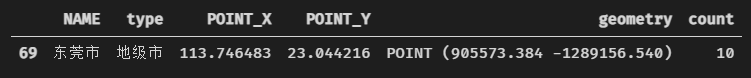
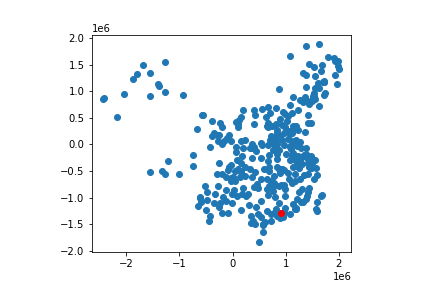

# **实习四 GeoPandas 操作**

## 问题重述

已有我国的地级市城市分布数据（china_cities.shp，实习二已使用），空间参照系统为 Albers 投影坐标，坐标单位为米。

1. 分析每个城市周围 100km 范围内有多少个城市，把统计得到的结果作为新字段（count）添加到城市分布数据，并写到新的 shapefile 文件中。
2. 提取 count 字段值最大（即 100km 范围内城市数最多）的城市，显示地理表格数据。
3. 利用 plot()方法叠置显示所有城市和 count 字段值最大城市（用不同符号区分）

## 问题分析

本练习与课程 PPT 第八章 地理表格数据操作 p60-64 的示例相似，可仿照示例编写解题代码

## 代码实现

1. 引入所需的 geopandas 库

    ```python
    import geopandas as gpd
    ```

2. 读取中国地级市分布点文件，返回 GeoDataFrame 数据对象

    因为地理要素的属性信息涉及中文，需要指定读取编码为 `"utf-8"`

    ```python
    cities = gpd.read_file('./GeoData/china_cities.shp', encoding="utf-8")
    ```

3. 循环读取 GeoDataFrame 数据对象内的每一个城市点，计算城市周围 100km 范围内的城市数量

    GeoDataFrame 每一条记录的 geometry 属性记录了对应城市的坐标信息，对其循环遍历，创建 100km 缓冲区，并统计落在缓冲区内的城市数量，每次循环计算出的结果追加到一个列表中，最后得到每个城市 100km 范围内的城市数量，把列表作为新列（count）添加到 GeoDataFrame 数据对象中

    ```python
    # 新建空列表用于存放每个城市 100km 缓冲区范围内的城市数量
    in_buffer_count = []
    for point in cities["geometry"]:
        buffer = point.buffer(100000) # 创建缓冲区
        in_buffer = cities.within(buffer) # 判断城市是否在缓冲区内
        in_buffer = in_buffer[in_buffer == True] # 选取落在缓冲区内的城市
        in_buffer_count.append(in_buffer.count()) # 统计在缓冲区内的城市数量

    # 添加 count 字段
    cities["count"] = in_buffer_count
    ```

4. 找出 100km 缓冲区范围内的城市数量最多的城市

    ```python
    max_count_city = cities[cities["count"]
                         == cities["count"].max()]
    # 输出 100km 缓冲区范围内的城市数量最多的城市的具体信息
    max_count_city
    ```

    <div align="center">
        
    </div>

5. 输出 shapefile 文件

    ```python
    # 将带有 count 字段的 GeoDataFrame 输出为 shapefile 文件，注意编码为 "utf-8"
    cities.to_file('./GeoData/count_cities.shp', encoding='utf-8')
    ```

6. 绘图显示

    ```python
    ax1 = cities.plot()
    max_count_city.plot(ax=ax1, color='r')
    ```

    <div align="center">
        
        <p>所有城市位置和 count 字段值最大城市</p>
    </div>

## 作业中存在的一些问题

1. `"utf-8"` 编码

    有同学提交的作业结果在 ArcGIS 中打开后属性表内的中文内容为乱码，因为练习中的 shapefile 文件涉及中文，然而写 shapefile 文件时，缺省的字符编码是 ASCII 码，所以产生这种现象

2. 运行效率

    有同学在统计每个城市周围 100km 范围内的城市数量时采用了两次循环实现，在数据量较大时的效率较低，还有采用 `distance()` 函数计算距离的实现，这些方法的代码可读性和运行效率都比不上直接对整个 GeoDataFrame 集中操作的方式

## 示例代码

[lab4.ipynb](./lab4.ipynb)
